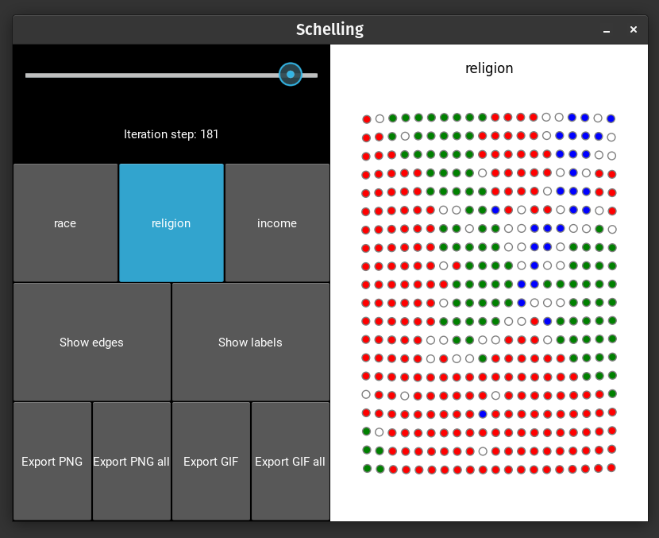
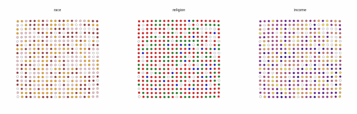

# Schelling Games Engine

## TLDR

A repo containing an engine, and a UI display, for Schelling games. It's made so that it's easy to configure specific games, even quite custom ones, through a dozen or couple-dozen lines of code per game. It runs with Python >= 3.10

Schelling games are 0-player games used in a few fields of research, related to both computer science and economics (algorithmic social choice, resource allocation, etc; I've even seen examples in physics). They were originally developped as a model for how segregation can emerge from a tolerant society. A phenomenal (and adorable) explainer about Schelling games can be found here: https://ncase.me/polygons/.

Where our work goes further than the previous explainer's simulator is by considering the multiple extensions of the model that can be found in the literature (k > 2 types, continuous types, etc).

## Original goal

I like agent-based models. I also like the interaction of discrete and continuous mathematics. I found this subject interesting. I did this over a couple of days.

I tried to emphasize three things above all:
- make the code modular to reinforce composability
- make my code as configurable as possible
- not sacrifice semantic type-hinting

Secondary objectives:
- have the app be sufficiently user-friendly and intuitive
- have it not be painfully slow

## Installation & execution

Dependencies: `pip3 install pillow networkx kivy matplotlib kivy_garden.matplotlib`.

Running: `python3 -m src.main`.

Configuration happens through editing the code for now; not via terminal, nor config files, nor via the app. Look at the provided examples in the `main.py` file for inspiration.

## Other info

### General description

The application is a general, rudimentary UI, with a colored graph display. It calculates all steps in the Schelling game simulation, then launches the display. You can then explore the results of the simulation:

- you have an iteration slider

- you can switch the display between each type via radio buttons

- there's a Hide/Show label toggle for agent IDs

- there's a Hide/Show edges toggle for the edges in the graph.

- I want to add a "legend" display toggle, but haven't done so yet.

- I want to add a "utility color display" option, but haven't done so yet.

### Examples

I've provided 2 examples, both using ample amounts of random generation. One is simple (one binary discrete type), the other is more complex (3 types, 1 continuous, 2 categorical with 3 values each). You can see the code at the bottom of the file.

### Features

#### Game config

I've implemented jump, swap, max jump, and max-unilateral-mutually-beneficial swap move games. Global optimal max swap is quite costly, and I didn't feel the need to implement it. The amount of iterations is configurable, and the simulation stops automatically at equilibrium.

I could probably implement a cycle-recognition halting condition as well, without too much effort (i.e., not just equilibria, but also measuring orbits, or even measuring orbit up to some tolerance).

#### Network topology

You can select a topology from a bunch of defaults, or add custom graphs. This includes stars, trees, toroids, cubes, etc. Technically, you can also turn these into MultiGraphs, DiGraphs, MultiDiGraphs, though only the first of these could eventually make sense as-is, and I haven't seen uses of it in the literature.

I also did not implement ultragraphs (implementation relying on DiGraphs which wasn't neatly compatible, and would have been much more challenging). However, I do want to do so at some point, in particular to model one specific case: international migration with contraints based on language or cultural norms.

#### Highly configurable agents

Agents are given a vector of types, which can be both discrete (categorical) and continuous (compact interval). Agents can be random, strategic, or stubborn, and any mix of these, in configurable proportions. The happiness level (min utility) of agents (threshold over which agents do not move) can also be configured.

#### Distribution of agents

You can select a distribution for each of types from a bunch of defaults, or add custom distributions. This includes uniform, choice, exponential, etc.

#### Utilities

I've implemented a few utility functions, including absolute count, ratio, and a few others; with configurable weights and thresholds. I've also left options to leave way for social games by providing a graph (or any context argument, really) to utility functions, but haven't tested it thoroughly.

I would also like, with time, to add a "utility color display" option.

#### Import/export

I made a png and gif export feature, and you can export a view of a single type or all types simultaneously. However, the gif export is pretty slow and takes a LOT of resources from the machine, generally freezing it except for the step logging print...

The source of the issue seems to be the `nx.draw` function: I tried `os.nice`, I tried polluting with `sleep` (even pretty long ones), I tried multithreading. None of that works: I suspect networkx is just not that well implemented. I do have a rendered graph caching mechanism that makes things a bit better. Maybe one day it'll make me mad enough that I make a GPU-based Python graph library...

I've considered a "simulation save/load feature", that I might implement sometime.

## Style & quality

I've provided a high amount of semantic typing to make code more legible, as well as comments over types, and over less intuitive parts. I've tried to divide it into modular files intelligently.

The overall pipeline has been thoroughly tested, but a lot of the optional features (some graph types, some distributions, etc.) have not.

With too many iterations or too big a size (topology, amount of agents), the app can get slowed down or launch "App not responding; Wait or Force Quit" pop-ups.

I have beginnings of a "custom node position config" feature, but it's not fully implemented.

Also, Hide/Show labels display sometimes doesn't show all labels.

Finally, I haven't managed to cleanly remove Kivy's debug output from the Terminal, either. Believe me, I've tried.

## Contributing

PRs, comments and issues are welcome. I'd ideally like this to be useful for scientific purposes (even if only to build conjectures probabilistically), but for me to further this work, it'd probably need to garner any modicum of interest.

## TODOs

- add a "legend" display toggle

- add a "utility color display" option

- implement a cycle- and/or orbit-recognition halting condition

- implement ultragraphs

- implement a "simulation save/load feature"

- render via GPU

- clean up Kivy debug output

- fix Hide/Show labels display

- add more tests and examples

- maybe improve topology and distribution features

## Example gif

